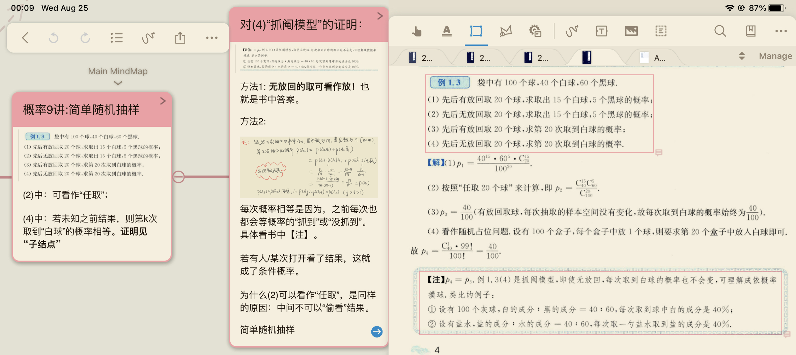

# 概率论

[toc]

## 什么是概率？

我们在接触一门学科时（或者重新思考以前学过但并未进行过深入思考的学科时），我们要从实际出发，想象这世界上的诸多现象，有哪些是已有的知识框架解决不了的，为什么？是因为这些现象不在其基本假设的范围内？还是因为这些现象可能需要更多“更离谱”的假设来简化我们已有知识框架内的计算（精度允许的范围内）？（我在《物理科普---科学与假设》一文中论述过学科与科学的相关问题。）

上述问题可能太过抽象，我来举几个例子：

- 骑车去上学

我们在中小学经常做类似的题目，骑车去上学，一共50km，速度50km/h，需要多久到。

但问题是：这车总不能一骑上就50km/h吧，总不能到学校了还是50km/h的速度吧？所以当我们学了加速度后就有了改良版------先加速后减速，好吧，这好多了。

但问题是：总不能转弯还是50km/h吧，没有绝对的匀速，这太不精确了吧。所以大学学了微积分的我们就又有了改良版------其加速度取决于踩油门的力度，其满足一个函数f(t)，求其速度随时间的函数及多久到，嗯～这好多了。

但问题是：骑车的人摔倒了，在地上连蹦带跳滚了三圈，试问他脸朝地下的时候的脸的速度是多少？这是个复杂的问题，当然并不严谨，但是我想说明的是，我们会发现之前几个问题，就算我们到大学学到了微积分，却还是在把物体当作质点（简单来说就是忽略它的体积）看待，但很多时候我们需要研究一个物体本身的旋转，那怎么办呢？学了《理论力学》的同学们就被伟大的科学家们又上了一课------用微积分、牛顿力学，再加上“刚体”的假设，就可以“简单”的描述一个可以忽略其形状变化的物理的一切运动！

我可以一直这样说下去，但这样就跑题了，这个话题应该是------我们看似相互分离的众多学科时如何相互联系、相辅相成的解释这个世界的各种现象的。所以回到主题------**概率论这门学科是在解决哪些问题呢？这些问题为什么不能用上述的微积分、牛顿力学、理论力学甚至量子力学来解决呢？概率论又有着什么基本假设来与上述几门学科区分研究对象的呢？**

接下来我将细细解释这几个问题，但我想先说一句，**比起答案，这些问题更重要。**若没有问过自己这些问题，怎敢说自己学懂了，甚至学过这一门学科呢？即使自己考了满分，当别人问起我来：你学过概率论吗？我只能说：我考过。

什么是概率？几乎每个人都用掷骰子来做过某些决定吧，比如谁的点数最小谁就下去拿外卖？这个问题还是太复杂了，就拿掷硬币来说吧，我们为什么要用这种方式来做决定？因为我们相信每个人掷硬币都无法确定结果是什么，虽然知道不是正面就是反面，且我们几乎都相信不管谁掷硬币，正面的情况和反面的情况应该差不多的，所以应该没人在意规定正面还是反面对应哪种决定吧。但是为什么呢？硬币即使不可以看作质点（毕竟只有考虑旋转运动才可以得到正面或反面吧），那也可以看作刚体吧，用我们上面讲到的理论力学不行吗？

答案是行！用理论力学的分析方式，只要我们知道了硬币在手上的初始位置，手在掷出一瞬间的力的施力点、大小和方向，就可以预测硬币接下来的一切运动，当然也可以知道他掉下来时正面还是反面在上。（但是细心的读者应该发现了，手是只有掷出时给硬币作用力，但是硬币还受重力呀，空气阻力呢？有气流呢？这就要用到流体力学了呀）没错，所以当一个人用一个真空装置给你掷硬币时，你要警惕了，他很有可能计算的出硬币的正反。但是事情还是没这么简单，首先：需要在硬币上布置几个陀螺仪来检测其运动，还要力传感器检测初始受力，还要蓝牙装置将信号传送至计算机实时快速计算，在落地之前算出结果，加上这些装置之后的硬币还要保证其质心在其形心上以保证对称性。而且这还没考虑电磁场对其的影响，可以加一个电磁屏蔽装置。

讲了这么多，读者应该明白了什么是概率------**一个事件的影响因素太过复杂，以至于在绝大多数情况下在其结束之前无法预测其结果具体是什么，这时我们可以根据其对称性“大胆”预测其所有可能结果出现的“可能性”相等。这个可能性就是概率。**

PS：这种“对称”的“等概率”假设非常广泛，很多物理定律也是基于此，下文可能会提到一些。

## 什么是分布？

上文说到：一件事情太过复杂，以至于我们只能大致判断它可能的结果有哪些种，却不能预测具体哪一种结果发生。那上文中说到我们既然都不清楚，就假设所有结果发生的概率相等，那这世界上所有搞不清楚的事情发生的概率相等咯？

上文中我强调了根据《对称性》才能假设这些“对称”的结果概率相等。举个例子：还是硬币正反面，我们假设硬币正反面概率相等并不是冲动为之，一方面是硬币我们可以近似看作一个中心对称的物体，另外其外部影响因素，比如风向和风速、电磁场，我们也很难确定其对硬币正面或反面有不同的影响。所以才假设其概率相等。

而我们若假设掷100次硬币，想看看硬币正面的次数是多少，或者每个可能的次数（0次到100次）对应的概率是多少？这就像是掷硬币。我们能说为1次、2次...、100次的概率相等吗？不，那为什么不能呢？因为我们无法假设它的对称性（事实上它们也具有一定的对称性，比如1次和100次是对称的，所以这两件结果的概率相等）。所以这时候我们就要从最基本的我们知道是对称的情况出发，一点点的去推理上述的每一种结果的可能性。**很多情况下，我们需要考虑的事情是由这些基本的对称的事情组成，而其组合较为复杂以至于没有了一定的对称性，所以不同的结果呈现出了不同的概率，而这时候对于这个复杂的事情我们可以推理出它的每一种结果对应的概率，这就称为这满足这个“分布”。**

所以我们对于一类事情，关注点不一样，所得的结果就不一样，所呈现的分布就不一样。这就有了千奇百怪的各种分布，而它们其实大同小异，甚至几乎每种都可以被“掷硬币”这件事来推理出来。比如妇孺皆知的正态分布，还有没有学习过概率论的读者可能没听过的泊松分布、指数分布等等，它们本质上都是掷硬币问题的推广，如果接下来我们能理解这些，也许就能对概率论有了深刻的认识。

## 抓阄模型

## 具体什么是事件？什么是条件概率？

这部分在这里有些突兀，文章前面已经说明了什么是事件，那为何还问：“什么是事件？”？因为我发现即使我认为我讲的很清楚的概念，但由于它的抽象性，还是会有不同深度的理解，而**对一个相对“复杂”的例子深度的剖析，往往才能使得对概念的理解变得深刻、准确。**所以这部分我就举一个“常见”的例题，来深度的讨论下，如何描述一个事件？并对比总结：什么是条件概率？

### 前言？

一号解答是我的解答，同三号解答是一样的方法，只是思路顺序、事件描述上有所变化，但这正是此篇文章的重点，二号解答思路“惊奇”，也是本文的灵感来源。读懂本文后你会明白，只要你的思路清晰，你可以任意描述一个事件，用任意喜欢的思路去解答，结果最终会是对的，而且会发现，结果正确的解答中，虽然看似思路不一样，但是对比就能发现其本质规律。

题目的求解反而是次要的，但明白求解步骤与方法是理解本文的前提，求解本身就需要读者具有一定的概率论基础，但是所谓的基础，都是可以用聪明的头脑代替的，因为毕竟这些基础都是聪明头脑（科学家）思考的结果罢了。

### 题目

设有两批数量相同的零件,己知有一批产品全部合格，另一批产品有25%不合格。 从两
批产品中任取1只，经检验是正品,放回原处，并在原所在批次再取1只，试求这只产品是次品的概率。

### 1号解答

---

设所求事件为$$B$$。令**在第一次取出正品的条件下，取自第i批为事件$$A_i$$。**由题目中$$B$$事件描述是在原所在批次再取一只。则 $$B=A_1BUA_2B$$，又因 $$A_1、A_2$$ “互斥”​，所以有：

​		$$P(B)=P(A_1B)+P(A_2B)=P(A_1)P(B|A_1)+P(A_2)P(B|A_2)$$

由两批次的合格率可以直接得出：

​		$$P(B|A_1)=0;P(B|A_2)=0.25$$

由上述可知$$A_i$$是一个条件下的事件，我们设第一次取出正品为事件$$X$$，取自第i批为事件$$Y_i$$，

显然 $$P(Y_1)=P(Y_2)=0.5$$，且$$Y_1、Y_2$$  “互斥”（也就是如果发生$$X$$，则不是$$Y_1$$发生，就是$$Y_2$$发生），则$$P(X)=P(XY_1)+P(XY_2)$$，所以有：

​		$$A_i=Y_i|X$$

​		$$P(A_i)=P(Y_i|X)=\frac{P(XY_i)}{P(X)}$$

​		$$P(X)=P(XY_1)+P(XY_2)=P(Y_1)P(X|Y_1)+P(Y_2)P(X|Y_2)$$

又由两批次的合格率可以直接得出：

​		$$P(X|Y_1)=0;P(X|Y_2)=0.25$$

最后我们将$$P(A_i)$$代入第一个式子，就得到了答案。

### 2号解答

---

设事件$$A$$为两批产品中任取一只为正品，事件$$B$$为原批中再取一只为次品。则题中所求为：

​		$$P(B|A)=\frac{P(AB)}{P(A)}$$

设取自第i批为事件$$W_i$$，

$$P(A)=P(AW_1)+P(AW_2)=P(W_1)P(A|W_1)+P(W_2)P(A|W_2)$$

下面求解$$P(AB)$$：

$$AB=W_1AB$$ U $$W_2AB$$，又$$W_1、W_2$$“互斥”（这里的AB要和B以及所求的B｜A区分开，具体到《剖析》部分的Q1中会重点讲解），所以有：

$$P(AB)=P(AW_1B)+P(AW_2B)=P(AW_1)P(B|AW_1)+P(AW_2)P(B|AW_2)$$

有$$P(AW_i)=P(W_i)P(A|W_i)$$，其中：

​		$$P(A|W_1)=1;P(B|AW_1)=0;P(A|W_2)=0.75;P(B|AW_2)=0.25$$

最终代入可以得到答案。

### 3号解答

---

设$$H_i(i=1,2)$$为“第一次从第i批产品中抽取”。$$A$$ 为“取正品”。则有：

​		$$P(H_1) =P(H_2)= \frac{1}{2}$$

即有：

​		$$P(A) =P(H_1)P(A|H_1) + P(H_2)P(A|H_2)$$

从而有：

​		$$P(H_1|A)= \frac{P(H)P(A|H_1)}{P(A)}$$

​		$$P(H_2|A)==1-P(H_1|A)$$

又设$$C_i(i=1,2)$$为“第二次从第i批产品中抽取”，则有：

​		$$P(\bar{A}) =P(C_1)P(\bar{A}|C_1) +P(C_2)P(\bar{A}|C_2)$$

求解完毕。

### 剖析

接下来我将以问题和回答 (Q/A) 的方式剖析这个题目以及这三种解答。

---

**Q1：为何在2号解答中，所求概率为何变成了一个条件概率？这个解答中的B事件同1号解答的B事件、3号解答的$$\bar{A}$$ 事件有和区别？**

**A1 :**

首先，**一个事件在不同的表达方式下就会有不同的形式**：

* 一号解答中的B事件为所求事件，这隐含的信息就是：B事件 = 在已知第一次抽到正品的条件下，第二次在原所在批次抽取，结果为次品。其实这本身就是一个事件条件下的事件。
* 类似的情况很多，比如我可以设第一批中抽到次品为事件W，则W也可以描述为在抽自第一批的条件下抽到次品。这是W就好像是一个事件条件下的事件。在本题中也有例子，比如1号解答中的$$X|Y_1、B|A_1$$，3号解答中的$$A|H_1、\bar{A}|C_1$$，就对应着$$W/\overline{W}$$。
* 现在再看2号解答中将所求事件设为$$B|A$$，就不难理解了，但是需要注意的一点是，2号解答中B事件的描述可能会引起歧义，这个原批取，是包含了A发生的条件下了吗？因为题目中给的条件就是A事件发生了。 所以**2号解答的B世界的完整描述应该是这样：第一次两批中任取一个，放回，并在原批次再取一个为次品。**注意到，其与1号解答中的B事件区别就在于1好解答的B事件包含了取出为正品这个事件的发生。

---

**Q2：3号解答中A事件为取正品，而最后求的是$$\bar{A}$$，$$\bar{A}$$的概率不应该是$$1-P(A)$$吗？**

**A2：**

这里存在说明不足，可以说是一个错误。严谨的来讲，A事件应该为在两批中任取一个为正品，则$$\bar{A}$$很明显不是所求的事件。而所求的事件的准确描述在**Q1**的回答中已经说明了。所以这里就是错误。

值得说明的一点是：**有很多时候一个事件的准确描述太过复杂，我们往往会简略说明，但正因如此，这个简单的描述会误导我们之后的思路，从而使解答一步步出错。**

---

#### 什么是条件概率？

所谓的**条件概率是该事件为一个事件发生的条件下发生的概率**。而**关键在于这个条件是一个随机事件才行，如果是一个确定的必然事件，就不能称为”条件“。因为没有意义。**这个表达很难理解，但确是本文的重中之重。举几个例子：

1.

>  对于题目所求事件，其前提条件众多：
>
>  * 条件（事件）1：在两批中任取一个产品
>
>  * 条件（事件）2：取出的产品为正品
>
>  * 条件（事件）3：将取出的产品放回
>
>  * 条件（事件）4：在原批次中再取一只
>
>  * 条件（事件）5：最后取出的这个产品为次品
>
>  * 隐含条件：放回原批和原批中取，但我们并不知道这批是题目中的“哪一批”。（这容易理解，只有生产者才知道批次，我们作为检验者，只能自己划分1号、2号批次，而不知道1、2号批次的正品率）
>
>  当上述条件全部成立，就是所求事件。那要不要分别设对应的5个事件ABCDE，然后所求为：E｜D｜C｜B｜A呢？并不。why？
>
>  **因为条件1、3、4为确定的必然事件，而只有条件2、5才是随机事件。**比如条件1：在两批中任取一个产品，我们只能取一件产品，不能取两件，不能不取，就是确定的这个事件，而条件2：在条件1下取出的产品为正品，这并不是确定的，因为可能取出的产品为次品。所以：**有些“条件”是题目给出的限定条件，它并不是个随机事件，那它在概率论中就不是条件概率中的那个“条件”。**
>
>  
>
>  也正因如此，有些必然事件“强行”作为条件，会有歧义。比如上述的条件4：原批中再取一只，它必然在条件1、条件3的前提下，若没有第一次取产品，何来原批呢？但若我们《**将必然事件作为其后发生的随机事件的一部分**》，事情才容易合理解释：
>
>  * 设A=新事件1：在两批中任取一个产品，取出的产品为正品。
>  * 设B=新事件2：在两批中任取一个产品，将刚刚取出的产品放回，在原批次中再取一只（但并不知道具体是哪一批）。最后取出的这个产品为次品。
>  * 设C = 新事件3：在两批中任取一个产品，取出的产品为正品。将刚刚取出的产品放回，在原批次中再取一只（但并不知道具体是哪一批）。最后取出的这个产品为次品。
>
>  仔细观察前后的变化，“新事件”才是最完整的描述，当然做题时不需要描述的如此仔细，但是如果把自己迷惑了就得不偿失了。注意新事件2，也就是上文事件B，是没有包含第一次取出为正品的。而这个B，正是2号解答中B。事件C=AB，而原题所求为P(B|A)。这种思路还有一个容易出问题的地方：原批也就意味着：A交与“取自第一批” = AB交与“取自第一批”。总之，怎么个思路都是条条大路通罗马的。
>
>  进一步探讨：A与B事件独立吗？P(AB) =? P(A)P(B)。其实仔细思考下B事件会发现，B事件就是一次新的$\bar{A}$事件，也就是说：如果我们不知道第一次拿出来的是不是正品，放回后再抽一次，其实这个事件跟直接随机抽一次是一样的，即$P(B)=P(\bar{A})$。？？？？？

2.

> 而且**这个“条件”是否可以称为随机事件是视情况而定的**。比如我就一批产品，次品占25%，那我随机抽取一只为次品记为事件K，概率0.25。这也是在默认条件（我抽取自这一批产品）下的，但是只有这一批，我也在这一批中抽，这个所谓的“条件”就不是个随机事件。
>
> 反观题目中的两批产品任取一只，而这个抽取自哪一批就成了不确定的随机事件了，此时第二批的25%的次品率本身就变成了条件概率——在抽自第二批的条件下为次品的概率。

## 基本概念

首先说明，我是不倾向于在文章中大量提及专业术语的，但是无奈概率论很多术语很违反常理，我要不提的话，就会出现我的文章你看的挺明白，要是拿本教材学起来就一脸懵逼，所以还是解释一下这些基本概念（专业术语）。

------

专业术语这个问题要说起来可能就是一篇文章，这里不能聊太多，但还是想讲一些我的看法：**所谓专业术语，就是我们** **对一些事物的准确描述** **用一个词或者符号来代替，就是为了简化今后更为复杂的准确表达****。**

所以专业术语是有意义的，因为我们必须准确的表达，才能准确的计算，才能准确的预测或改变某些事物的运动规律，而这个世界上的多数事情本质上都可以用基本的运动规律所描述。

比如我写一个sinx，我们不需要对经过相关专业训练的人说：什么是圆，什么是角，三角形怎么又可以和圆联系起来，我们怎么用角来表示三角形中两个边的关系，从而定义了三角函数，有了sinx，其满足怎样的基本特性，又如何证明等等。

问题就是很多看起来经过相关专业训练的人并不了解这些专业术语，而只是知道大概，而且我回忆起来，我当年大学学习的时候也不懂，回看大学教材发现教材也不写，好像大学老师也不说，他知道与否我不清楚，但是**我写这些的目的就是希望接下来的学生应该去思考这些基本问题，这些概念定理恰恰是一门学科最有趣最核心的问题，而不是背过这些去做题。**

### 随机事件

**随机事件是随机试验一些可能的结果。**

而这里一个“可能的结果”是一个样本点，也就是我们提到的一个试验中不可分割的结果。

1. 随机事件是结果

  2. 随机事件是某个随机试验的结果

### 随机变量

一方面，我们希望进一步简化这种描述方式，进一步研究其规律。比如对于掷硬币是正还是反；考试是过还是挂科；灯泡是故障还是正常，它们是有共性的，我们怎么抽象描述这些。

另一方面，有些问题不好语言描述，比如全世界人的身高，几乎是**“连续”**的取值，166.68556cm也有，166.68557cm也有。（注：关于连续，我们可以讨论很久，这也是个关键的概念，而如何精确的定义出连续这个概念，就引出了整个微积分，这就不是本篇文章的内容了）那我们怎么写出每一种可能（样本点）的概率呢？所以我们就可以用函数来表示，这个函数就叫“概率密度函数”。那这个函数有什么意义呢？为啥叫密度呢？

我们规定函数值来表示在这一点附近发生概率大小的程度。比如上图，我们一看便知身高170cm的人好像更多一些的样子？很明显这不准确。准确的描述需要微积分的基础，比如上图阴影区域的面积就是身高在150cm～151cm的概率，而当这个间隔很小的时候，比如150～150.000000001cm，落在该区间的概率就可以近似看作f(150)*0.000000001。这就有点跑题了，但是对比物体的密度，这的确可以理解了，每单位量级的“长度”的概率，就是概率密度。

Anyway，这为了说明**将语言表达数学化会使大量准确的信息被简要的表达出来，当然代价是所有人需要首先学会这些表达。**

------

**随机变量是个特殊的函数，每个基本事件**（事件由基本事件构成，所以同样也是每个事件）**对应着实数轴上的某个点，而这种对应法则（函数）可以人为任意规定**，只要满足定义的条件即可。比如我可以规定硬币正为0，反为1；也可以正为1，反为2，这一点就跟代码很像了，我们将很多信息抽象成数字，比如26个英文字母对应的数字就是ASCII码。而这种规定具体的实现没有太大意义，大多是约定俗成。

1. 随机变量是函数

2. 随机变量的定义域是样本空间，值域是实数域

以掷硬币为例子，现在我规定随机试验为独立掷硬币10次。那么：

1. 5次朝上，是一个随机事件。

2. 10次硬币分别为正反的排列组合中的一种为一个样本点w（基本事件），所有结果的集合为样本空间

3. 我规定，这十次每次为正为1，负为2。比如一个样本点为10次全为正，则用1111111111来表示，以此类推。而这种表示可以写作函数形式（因为一一对应）X(w)———就是随机变量。这个随机变量每有一个w（掷10次硬币的一种结果）就有一个数（就像刚才的1111111111）与之对应。

4. 随机变量的分布率，也就是每个X(w) 的那个数都有对应的一个基本事件，也就对应着一个概率，这个基本事件发生的概率。
5. 有了上述的随机变量和其分布，我们就可以计算任一事件的概率，比如我们上文提到的事件———5次朝上（这就是一个随机事件）。计算也很简单，就是找出满足这个事件的**基本事件**（比如10次分别为上上上上上下下下下下，这是一个基本事件，因为这是不可分的一种结果）们发生的概率，这其实并不好找。

### 总体与样本

什么是总体？普遍教材定义非常模糊，甚至有些糊弄。比如我们想要研究人的身高。可以认为全体人类的身高为总体。也就是研究对象的全体。而什么是样本？

#### 总体、样本、个体、与随机变量的关系

问题：**总体与样本是随机变量吗？**

* 总体不是随机变量，但总有与之对应的一个随机变量，其与个体同分布**。还是上文的身高问题，人的身高是一个随机变量，从0到300cm取值区间就是它的值域。而总体是全体人类的身高，它若是一个随机变量，它的取值应该是每个人对应一个身高，然后排列组合，所以这显然不对。所谓的**有些教材想表达的就是总体对应的这个随机变量，本例中就是人的身高。**（再复习一下随机变量的概念：比如某某的身高为165cm，这是一个事件，通过随机变量这个函数，得到函数值165）

- 但要注意的是，有人可能理解：总体不是随机变量，是因为总体是确定的。这个原因不成立。一方面：我们之前讨论过所谓概率，科学上理解没有绝对的随机事件（可知论）；另一方面：**结果（随机事件）是确定的还是随机的是相对于“调查者”而言。**比如我要掷硬币100次，决定找100个人每人掷一次，最后我统计结果。对我来说，我没有统计之前，每个人的硬币正反都是随机事件，其都可以用随机变量来描述，而在我统计之前，它们明明已经确定了结果，没有任何随机性而言，但这是对于这100人来说，对于我来说，他们的硬币正反就是随机的。
- 还要注意的一点是：类似的试验，随机事件、随机变量却全然不同，比如我研究100次掷硬币的结果，那么每个样本点就是这100次的结果，而研究掷硬币，那样本点就只有两个：正和反。

* 样本不是随机变量。与总体本质一样。

* 个体是随机变量。这如果理解了上文中“随机与确定”是相对于调查者来讲，基本就没什么问题了。要注意的是，若已经得知了结果，那这个结果不叫个体，叫观测值。

**举个例子：**

《掷硬币》，在以前我们研究的掷硬币正反作为随机变量X，这个X一般是指“特定的一个硬币”，所以我们才有掷n次的试验。但一个硬币能说明所有硬币吗？所以会有**两种情况：**

1. 假设我们要研究的是掷硬币（通用的、普遍的硬币），设它为X，所以上面讲的掷一个硬币就是个体X1，当然X1与X同分布，然后我们要研究很多硬币，全宇宙所有的硬币X1～X∞就是总体，而我们只能随机选一部分（X1～Xn）硬币做随机试验，所以X1、X2…Xn独立同分布。每一个硬币掷出的结果x1成为观测值。

2. 另外一种情况，就是我们研究掷“特殊”的一枚硬币X，而每一次掷出都是一次随机试验，其正反为随机变量Xi，而掷n次也可以看作对这个研究对象的一个样本（X1～Xn），而总体就是掷∞次（X1～X∞）。

此时问题就来了：**为什么掷硬币会出现这样的两种总体？那研究人的身高呢？**

* **上述的情况2-1**对应于人的身高就是：假设可以让人“从头来过”，他/她会再长出一个身高。从头来n次，就是样本。

  当然，也可以仅仅是: **情况2-2：将其身高多测几次，测量∞次为总体。**但这个意义不是很大，因为一个人的身高在一段很短时间内几乎不是变量，而几乎不变的一个参数，当作随机变量反复试验观测没有意义。

  从另一个角度讲这种测量也是有一定的意义的：在于验证测量时的随机性，而这个人的身高此时就是一个常数，也是测量身高这个随机变量的期望。研究对象变了，但是依然符合概率论。

* **上述情况1**对应于人的身高就是：全世界所有人的身高是总体，每个人的身高是个体Xi是随机变量，我抽n个人的身高，就是样本，每个人的身高量出的具体置xi就是观测值。

所以应该就可以明白了：**对于在一个物体发生的很多事件，没法从头来过，所以只能研究不同物体每个发生一次的这种对比，此时相比研究一个物体的现象，研究的对象其实变了，虽然看起来差不多。**

而且真实的测量与估计是需要考虑很多的，所以**“情况2-2”**中提到的情况在实践中非常常见，多次测量取均值，就是在尽可能避免测量的随机性，但是不要和最初研究的随机变量搞混。（PS：样本均值$$\bar{X}$$与期望$$EX$$并不相等，$$\bar{X}$$本身也满足一个分布，其期望$$E\bar{X}=EX$$罢了，这要展开又要说半天了）

### 期望与方差

我们如果知道一个随机变量的分布就可以“完全”预测它。（这里挖个坑，概率是不确定的，但是我们确定了它的分布，就确定了它每一种可能的结果发生的概率，那这叫确定的还是不确定的？所谓的量子力学就是将这种理论假设引入物理中，本质上规律还是确定的，只是一次试验的结果存在某种不确定性，而这种不确定性———“分布”是确定的）量子力学的问题我之后的物理科普会详细解释。

但有时候，我们无需这么复杂的分布率/分布函数来“了解”一个随机变量，这跟我们考试是一个道理：

我们如果知道一个学生每次考试，以及每次习题、作业的正确率及其解答方式的正确率，以及他/她对这个科目每个概念的理解，那么就可以完全确定他/她对这个科目的掌握程度。而这显然是很复杂的，我们就决定出一套卷子，尽可能的考到更多的知识点和概念，让这一套卷子反应该学生对该科目的掌握程度，这必然会有所偏差，但是相比于节省的时间精力，这是值得的。所以我们就想对随机变量也来这么“一套卷子”———这就是期望与方差。

关于期望与方差的概念，我感觉没太多难以理解的，基本就是字面意思，日后若发现问题再补充吧。

### 估计与检验

#### 前言

对估计与检验的深度思考后，这部分内容将让读者对概率论有深刻的理解！

既然我概率论文章一开始就不是针对初学者写的，那现在我也直接公式起手吧，但还是很建议有点基础的同学/读者可以看到最后，若理解了这部分，你可能会收获巨大。

什么是估计呢？我估计大家都没仔细思考过什么是估计。让我先来个浅显的例子：（这不是比喻，这真的是例子）

“我估计特朗普不是好人”。这句话没毛病，你若说：“特朗普不是好人”，这问题大了，这是一个复杂的随机事件，你若是说这是个必然事件，那我要提醒你，现实世界中几乎没有必然事件。比如"这世界的人类非男即女"，都不是一个必然事件。这就扯远了，总之，必然事件是一个理想情况。

所以我怎么估计特朗普不是好人呢？可不可信呢？首先我得说出特朗普不是好人的概率是多少？怎么得出概率呢？得有分布、有样本。分布就需要对好人有个准确的定义（而且这应该是一个量，而不是非好即坏的定义），找出人身上的特点，及满足这个特点的人是好人的概率（得“好人分”在高于b分的概率）。

这是个极其复杂的过程，但是可以想象，比如我以前听人说：“鼻子大的人是当官的料”，这可不能乱说，首先说概率，这个事件就比特朗普是不是好人简单多了。我们可以尽可能的统计全人类的鼻子维度，平均值为参考点，再统计当官的人的鼻子平均维度，最后比较其与参考点的差距，这只是均值；还要统计官鼻子的方差，甚至还要把当官定量下来（比如多大的官），然后计算官鼻子与官大小的关系等等。

虽然我没有去做这些实验，但我盲猜这和我当选美国总统概率接近。（注意盲猜是个准确的用词，这里我就不能估计了，因为我没有理论，也没有做试验，就是瞎猜）。好了，正文开始。

#### 正文

**所谓估计，就是我们根据假设的原分布推导出样本均值与样本方差应该服从的分布，然后根据样本均值去反推原分布期望（或其他参数）在某一范围的概率。**

这个我们假设的原分布，就是前言中的“好人的分布”，显然这是一个复杂的多维随机变量的函数的分布；这里的样本，就是我们看到的特朗普的表现，而总体显然是特朗普的一切表现与想法，这也是定义一个人比较准确的方式了。而我们根据现有的表现推测特朗普是好人的概率，就是估计。

* 问题：都知道了原分布，为何还要反推出原分布的期望？

* 答：准确的说，是**知道原分布的类型，而不知道确切参数**，比如知道这种情况要检测的“总体”（总体对应的随机变量X）服从指数分布，却不知道λ，这时就根据指数分布的表达式，求出样本均值、方差会服从怎样的分布（注意这个分布是与原分布的参数λ有关，往往其与原分布的期望EX有关），然后通过这个分布与测到的值，倒推出原指数分布的λ。

然而上文举的指数分布的例子会很复杂。而由于**正态分布的某些特性**，会让计算变得简单；且又因为正态分布有一定的普遍性（中心极限定理）。所以大学课程仅要求掌握原分布为正态分布下的情况。那我也会以正态分布为例：

> 按理说有中心极限定理，指数分布的Xbar与正态分布Xbar应该都服从正态吧？
>
> 中心极限定理要求n->∞，也就是需要样本空间无穷大，而事实上我们检测，抽取样本都是一个“小数量”，而正态分布有个特性：任意的n，都满足样本均值依然服从正态分布。

---

这部分是正态分布区间估计具体的推导过程。中间可能会忽略很多细节，因为教材上都有。另外由于有些平台不支持Latex，所以X的样本均值就用Xbar来代表。

X这样一个随机变量，比如就是某工厂生产的灯泡的亮度，服从正态分布挺合理。现在我们取了n个灯泡，第i个灯泡的亮度就是Xi，n个灯泡的平均亮度也是一个随机变量Xbar（注意，这个亮度是测量之前的，跟掷硬币一样，不知道它有多亮）。这是我们根据这n个灯泡的亮度独立同分布，等一系列“骚操作”，就得出了上图这个Xbar的分布函数。（课本都有证明过程）图像就是下图：

一般情况下（就像掷硬币）我们都是已知这个μ，让我们求Xbar若测量值在某个范围的概率，这种题也经常做。但这根本不是一般情况！我们哪知道这工厂生产的灯泡的亮度的期望？不可能知道啊！就是不知道才检测啊，啥都知道了还检测吗？

所以真正的一般情况下，我们不知道这个μ，我们找几个测一测，取个平均值，那这就是μ了？肯定不是啊！所以这时更能理解Xbar这个分布的意义------找的n个灯泡的平均亮度，期望是μ，方差是σ^2/n，也有波动，它在μ周围的概率较大（如上图）。

但话说回来，怎么用Xbar估计μ呢？它俩又不相等。我们都有它俩服从的分布了，也就是在任意区间的概率都知道！把这个Xbar“化简”一下，会更清楚：

区间估计就结束了。

---

但这样看起来可能很困惑：

1. 明明Xbar是变量，为何μ成了变量？

2. 此时测得的Xbar不应该代表全部的Xbar呀！怎能凭这一个X判定μ的概率？
3. 我们都不知道μ，居然还能知道（确定）σ？这不胡扯！

* 关于问题1: 我们为什么知道μ？事实上我们从不知道！**人类一直以来都是拿着试验结果X逼近一个值，然后思考出一套理论A来解释这个理论值μ是怎么来的**，而理论A就是分布函数。另一方面，μ和Xbar是平等的变量，若可以接受μ是常数，凭啥“瞧不起”Xbar呢？回答问题2时再谈。

  

  这时我们可以重新再再再**思考下掷硬币的问题**！就会发现，我们并不知道这个**EX = μ = 0.5**。而只是这么多年来的试验结果Xbar们，表明它非常接近0.5，所以我们相信（或者假设）在理想情况下，μ 就是0.5！然而大量教材却本末倒置的讲推测结果说成事实，试验结果却显得“轻浮”，这个思考推理的过程甚至只字不提！

* 关于问题2: 的确这样是不严谨的，所以往往会多测几组，就大致认为测量结果时准确的。准确的来讲，若假设分布是确定的（其实分布都是有偏差的），那么只能确定样本均值Xbar与假设的原分布期望μ的关系。

* 关于问题3: 的确，所以实际中会用另一个“更靠谱”的检验方式，也就是t分布检验，也就是将原分布标准差σ换成样本标准差S，化简一下服从t分布，这样未知的只有原分布期望μ了，也就检验的更准确了。

#### 简单谈点估计

所谓点估计，可以理解为简化的（不够准确的）区间估计。

点估计往往用与我们估计其他参数（比如λ），但这种参数绝大多数情况是期望μ的函数，我们其实可以用区间估计 估计出期望μ的在某一“大概率”取值的区间，然后根据函数单调性等解出所求参数λ的区间，这样比较准确，但是可能这样就复杂一些了吧，总之不是大纲要求，但需要理解到这一点。

## 几大常见分布及意义

从上文中我们可以知道，不同的试验就对应着不同的分布。在我们自然社会中，有很多试验服从的分布出奇的相似，典型的分布有几个，它们又对应着什么样的试验，让它们呈现出相近或者不同的分布规律呢？

### 二项分布

很多试验都可以从这个简单的试验说起：**“独立”重复**掷硬币N次，看看正面朝上的次数是k的概率是多少（要知道上文中说到的，比如一批次的灯泡N个，故障率为1%，求k个灯泡为正品的概率也是同样的规律）

本文不去陈述与计算具体的分布函数，因为这些随便找一本教材就说的很清楚，我要补充的是教材甚至老师忽略的一些问题。

### 泊松分布

经常听到：假期某地每日平均人流量10万。而我们可以**假设在此期间每个极小的时间段（假设1ms）都是一次独立的“掷硬币”**，也就是有一个人经过，或者没有，那概率就是100000 / (24*60*60*1000) = 0.116%。所以这就是一个N(N=24*60*60*1000)次的二项分布。我们可以预测明天为8万人概率为多少。

而这个分布函数（当这个N很大，且Np不大的时候）就可以使用微积分的一些小技巧近似一下，从而得到现在教材上见到的泊松分布公式。

#### 泊松分布应用场景

正如掷硬币每次环境可能不同，比如中间10次硬币旁边放了一块磁铁。能用泊松分布解释的随机现象也需要满足它的基本假设----每个极小的“时间”/“空间”段之间是相互独立且对称的服从同一个“掷硬币”的分布。

我们文章开头就强调了现实环境的重要性---有时候掷硬币可以看作一个力学问题并可以求出精确解，而大部分情况下，掷硬币的影响因素太多以至于我们无法（没有）去计算，所以可以看作一个随机试验。而同理，我们将不同次数的掷硬币结果看作独立的随机事件，也是假定它们之间的影响因素几乎没有太大变化。

若有呢？比如夏日的假期可能晚上比较凉快人流量多一些，那就不满足上述泊松分布的假设。这时就用它（泊松分布）来预测一系列相关事件的概率就是错误的。

（甚至我们可以抛弃正确错误这种“掷硬币”方式去看待它，而是讲它的**精确程度。**这种思想非常普遍---在任何科技领域都很重要---抛开精度与成本谈对错毫无意义。比如微积分的连续、“无穷小”、可导等概念在现实中都不可能存在，而比如像比与1cm的身高差距，1nm的身高差距就可以看作“无穷小”，等等）

### 指数分布

指数分布于上述的泊松分布有点联系。但是我们的关注点不一样了，也就是同样的随机试验，不同的随机事件：我们这次想知道，**如果连续t时间内，一个人没来，最终来了一个，概率是多大？**这个问题就很容易：就是次数在变，结果是全部没有发生，求概率。古典概型问题加一点微积分就可以推导出来。

#### 指数分布的无记忆性?

指数分布的确有这个特性，比如还是灯泡寿命的问题，我们这次看一只灯泡，假设它的故障率是一个固定值（比如1%），我们就可以套用刚才的模型，来描述。就可以得到这样的结论：如果这个灯泡已经使用了10年没坏，那它接下来坏的概率跟他刚买来一样。这就是所谓的无记忆性，这非常违背常识，有的老师或者教材还会拿这个举例子，很明显这就是错的。所以我就讲一讲这错在哪，以及这种特性的现实意义在哪里。

问题就出在最开始的假设：**假设在此期间每个极小的时间段都是一次独立的事件**。所以灯泡这次出没出故障与下次，下一万次没有关系，但是事实上是这样吗？当然不是，灯泡本身的部件都是损耗品，每使用一段时间损耗都会增加故障的概率，所以它的故障率并不是固定值。

很明显这个问题并不是科学证明了违背常识的现象，而是这个科学假设在这种情况并不适用。那有适用的情况吗？有——**原子的衰变**。这要细讲起来就又跑题了，但还是简要的说明下这个问题：

首先，之所以很多物质（包括人）随着时间会有“损耗”，本质上就是一个热力学中熵增的过程。而熵本身又在大量粒子才有定义（因为热力学问题可以不准确的理解为大量粒子的概率学分布问题）。而原子，尤其是较大的原子（为何较“大”的原子更不稳定，容易“衰变”，也就是所谓的有放射性，这里也不解释了）会有一定的概率衰变【所谓衰变，简单理解为原子内部分裂了，释放出了一些更小的粒子及能量（也就是光）】而这个概率没有证据表明其与原子“存活”的时间有关，从熵的角度也可以理解，因为一个原子内部基本粒子很少，不属于热力学范畴，就像是一个电子没有温度可言（这里听不懂没关系，信息量非常大）。Anyway，起码相比于我们的灯泡故障，原子衰变与时间的关系更小，所以它更适用于指数分布来描述。

PS：为什么原子的衰变会被看作随机事件？！这可是物理啊！回想我们一开始讲到的概率的本质，没错，这极有可能是人类还没有搞清楚它的规律，所以只能看作随机事件。其实物理（其他科学领域更是如此）能解释的的确很多，但是不能解释的更多，正如某句名言：知道的越多，不知道的就越多。但但但，科学有个共同点，就是如果有试验否定了我的理论，那一定就是理论有问题，也就是尊重事实。

### 正态分布

哇，这是另一个神奇的分布，可以说是“最神奇”的分布？读者可能听说过：一个班里同学的成绩服从正态分布（高分很少，低分很少，中间分很多），甚至有的学校会要求最终成绩符合这个分布，以至于老师要人为“调整”学生们的成绩来服从这个分布，简直就是笑话。

Anyway，正态分布要从“中心极限定理”说起，它在说这样一个问题：**任意一个总体的个体平均值都会围绕在总体（总体对应的随机变量）的期望周围。**而具体的分布为高斯分布函数。

上述的确不是人话，也就是有**很多随机变量，只要它们相互独立且服从同一分布，则它们的平均值服从正态分布**。

举例子：掷很多次硬币，每次掷硬币正反（1/0）都是相互独立且服从同一分布（就叫它0/1分布吧）的，所以这好多次硬币正反（1/0）的平均值服从正态分布，其期望正是0/1分布的期望---0.5。所以并不是随便啥随机变量就服从正态分布，首先需要多个独立同分布，且我们关心的是他们的平均值。关于正态分布的普遍性，就是接下来的重点。

#### 正态分布的普遍性?

关于正态分布为何是这种形式，还是要回到熵的问题上来。这个熵要说起来就又跑题了，所以挖个坑：正态分布就是已知均值与方差时，熵最大的分布。有兴趣的读者可以自行证明。

再者就是正态分布往往被夸大了其泛用性，事实上独立同分布是个非常苛刻的要求，在很多时候随机变量之间存在着强关联，而这就必然使得正态分布成为泡影。比如上文提到的考试成绩问题。事实上一个班级的学生考试成绩分布也很大程度上取决于任课老师的教学水平、态度和风格。比如一个老师认真负责，有意去叮嘱那些不认真听讲的学生，且其讲课风格幽默，能引发学生的兴趣，那么这同PPT读稿大师必然有所不同。可能全世界的学生成绩更容易符合正态分布，但是要求一个班级的学生成绩要符合正态分布，实属荒诞，本末倒置。

结果总是可以无限反转：我们在大学概率论的数理统计的一章中都是建立在正态分布的基础上，这有什么道理呢？

样本不服从正态分布时，“大”样本均值总会服从正态分布（中心极限定理）。问题：**样本均值服从正态分布，但这并不是最初研究的那个跟总体挂钩的那个随机变量啊，这对导致什么问题？**

