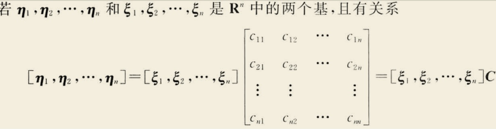
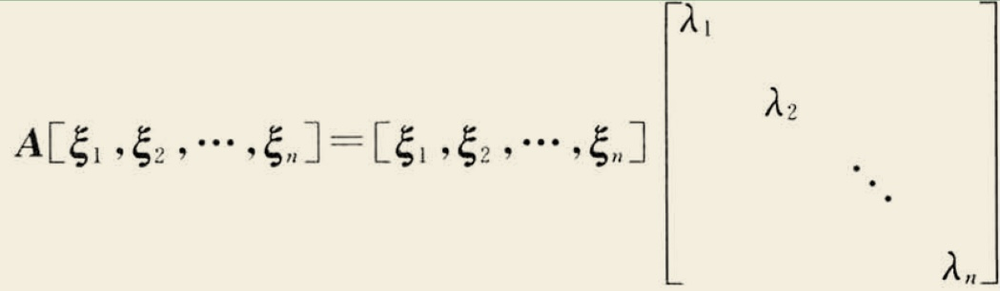
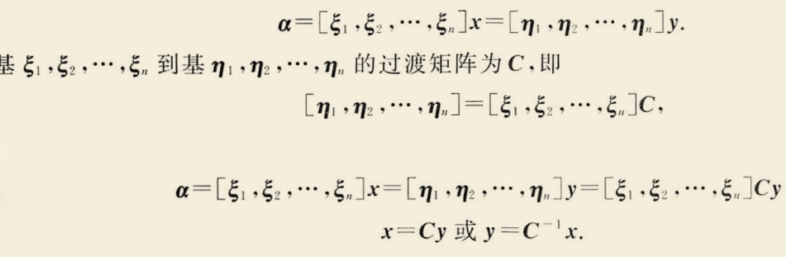
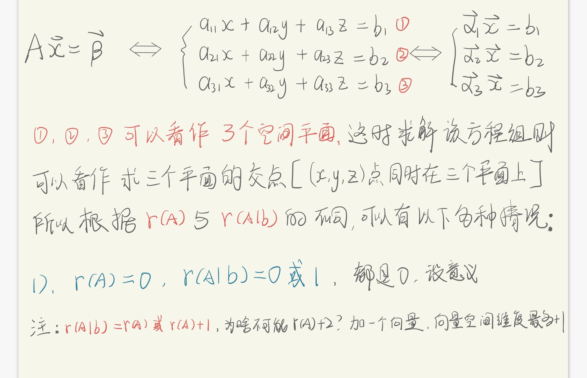
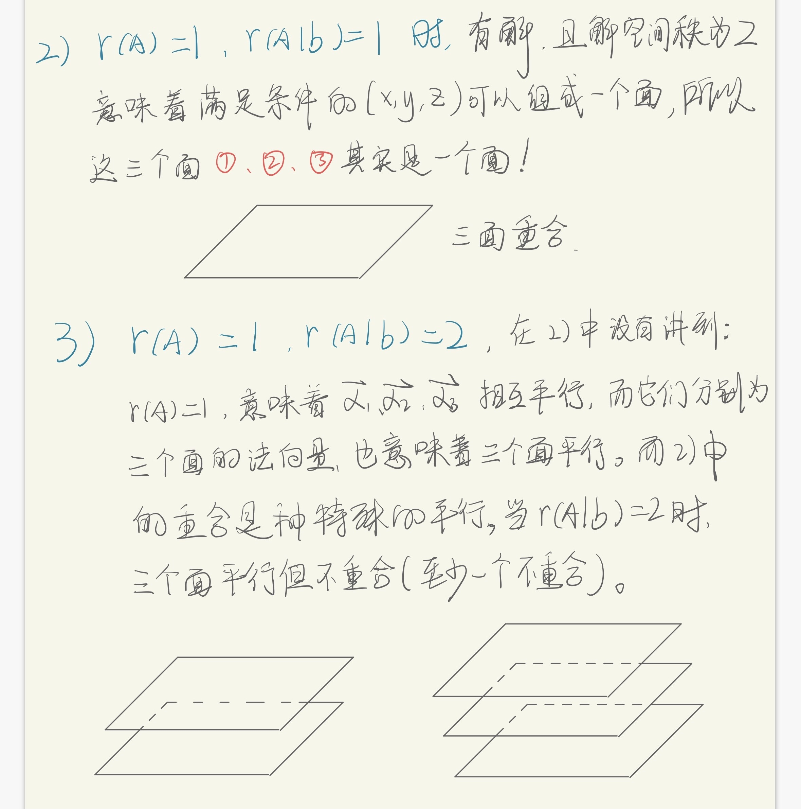
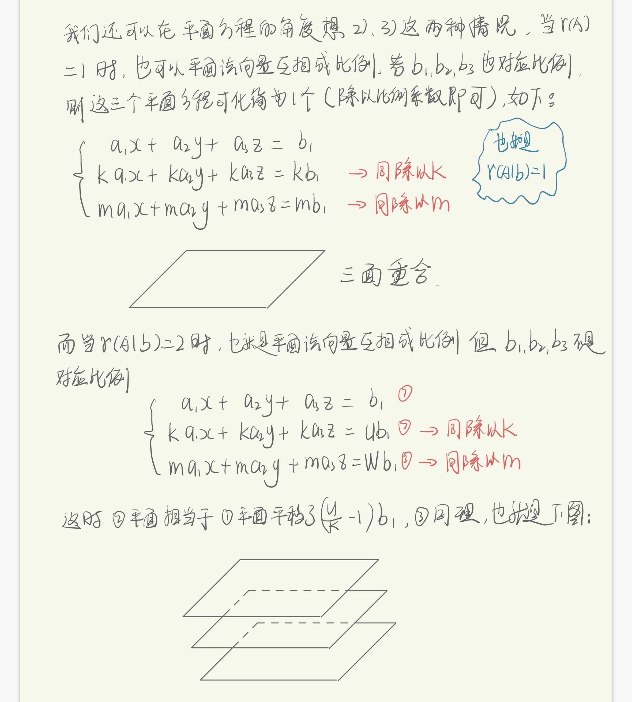
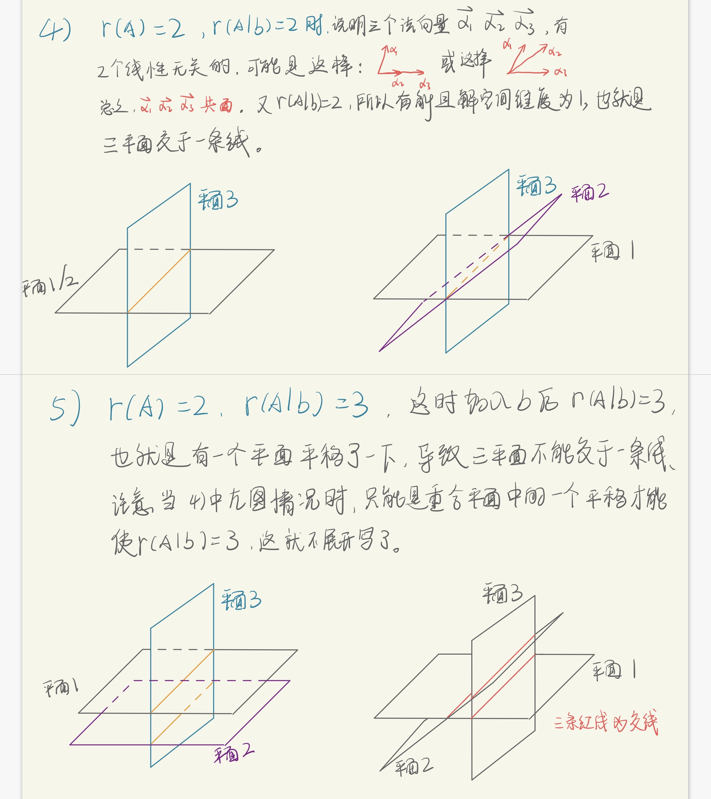
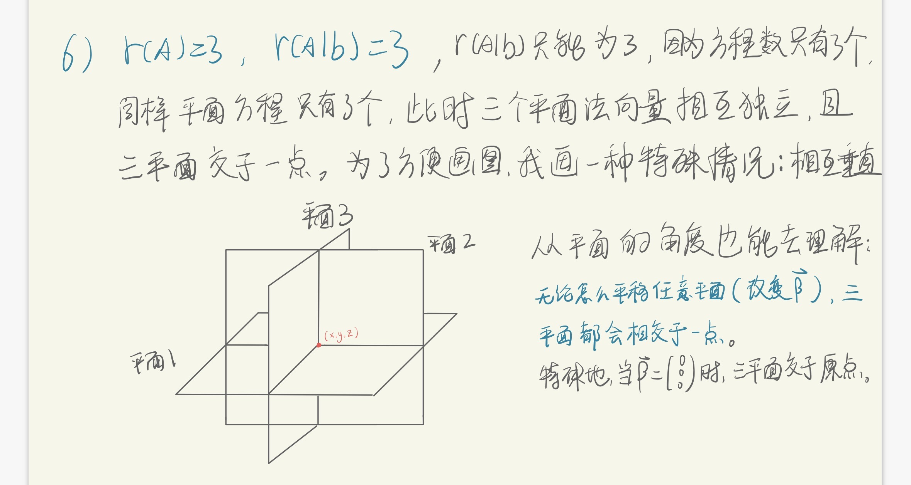

# 矩阵

矩阵不同于函数，是数学中对数字/符号的另一种组合和运算方式，那问题来了：

* 有了函数，为何还要矩阵？

* 矩阵和函数有着怎样的区别与联系（几乎是数学中两大基本运算）？
* 抽象的矩阵运算又有什么意义（物理意义或者现实意义）？

目前我还回答不了上述问题，尤其是---**函数和矩阵这两种非常基本的描述 量之间关系及其变化规律的“数据结构”，在本质上有什么联系和区别？**

[toc]

## 行列式

* 行列式的几何意义：

**一个矩阵的行列式就是一个平行多面体的体积**。而特殊的，长方体的体积就是长宽高的乘积（及正交矩阵的行列式为特征值之积）

## 矩阵行列对称性？

矩阵的行与列在很多时候是对称的，比如行列式：$|A| = |A^T|$；秩：行秩等于列秩等。但同时矩阵在很多时候行列又是不对称的，比如矩阵乘法：$AB≠BA$；在方程组中只能用行变换等。

Why？每个具体的问题，看似都有答案。但是why？这不是几个无关的具体问题，而应该有着更“广泛”的原因。

有时我会想起左右手，左手和右手对称吗？有一定的对称性，但又不对称（一只手无法通过平移、旋转与另一只手重合），这在化学的分子结构中也有类似的问题。虽然矩阵行、列具有天然的对称性，但我们对矩阵乘法的定义就有着不对称性（否则AB就有可交换性了）。

那么：**为什么要按照矩阵相乘的顺序，有不同的定义？这背后又有怎样的现实意义？是不是意味着矩阵行列天生也是不对称的？**

我目前的答案是：总要区分左右手，矩阵的行与列也一样，总要规定行向量之间的运算，与列向量不同的运算，那这个规定就是矩阵乘法，对应左乘与右乘（还有对象问题，因为AB可以做看作B左乘A，也可以看作A左乘B，但是方程组中就“只能”看做A左乘B）就是行与列运算的不同。

> 下面是我的一个知乎回答： 为什么矩阵左乘是行变换，右乘是列变换?
>
> https://www.zhihu.com/question/448879160/answer/1880462559
>
> 因为矩阵乘法的规定：拿右乘是列变换举例吧
>
> 1. 若将左边矩阵写成列向量的形式：
>
> k是数字，其余是向量
>
> 会发现，三个列向量α们的右乘一个矩阵得到另外三个列向量β们，而每个β都是三个α们的线性组合。
>
> 2. 若将左边矩阵写为行向量的形式：
>
> 
>
> 就会发现有所问题：β们并不能写成α们的线性组合，他们的关系变得复杂了起来。
>
> 结合上述两图不难发现，这两者的区别正是由于**矩阵乘法规定左边矩阵的第一行与右边矩阵第一列作内积得到矩阵左上角的数**。这天然就让左和右具有不对称性，左乘矩阵和右乘矩阵的区别也就不难理解了。
>
> PS：若我们可以修改矩阵的运算规则，比如AB=C中，**C矩阵左上角的数为A的第一列与B的第一行的内积，其余也相应变化。**那么结果就会相反了。
>
> PPS：上述只是拿右乘是列变换举例，左乘是行变换只是分析右侧矩阵罢了，读者可自行试验。

### 对于列向量组，“作用矩阵”时而在左、时而在右？

1. 在向量组表示/转化时，列向量组是在左边，作用矩阵C是在右边。如下图所示：

2. 在求特征值问题时，特征向量作为列向量组，而作用矩阵A是在左边，如下图所示：

#### 看矩阵运算的不同角度

在上节中我讲过矩阵乘法从向量组的表示角度的思考结果。讨论了为何有所谓的“左行、右列”。但是问题没有这么简单。何为变换？上图$\vec{ξi}$经矩阵A变为新的$λi\vec{ξi}$，这不是变换吗？

所以向量组的变换有两种：

1. 向量组为一个整体，变换后的每个向量都可以用原向量组的向量**们**线性表示，**所有表示系数为变换矩阵C**。
2. 向量组只是一种“组合”，其中每个向量都是“独立”的，变换后的每一个向量，都是原向量组中**对应的那个向量**经过A变换而来。

“上上图”中的矩阵C对应着第一种变换中的表示系数矩阵C；上图求特征向量的矩阵A，是第二种变换中的A。

---

但还没有结束！**C在另一个角度看，就是A**！

---

如下图所示：**α**是一个向量，所谓一个向量一组坐标，比如三维空间中$\vec{α} = \begin{bmatrix} 1\\1\\1 \end{bmatrix}$ ，但是我有一个“变换矩阵C”，它将原来坐标系的y轴转了180度，那么$ C= \begin{bmatrix} 1&0&0\\0&-1&0\\0&0&1 \end{bmatrix}$（至于为什么A是这样，读者可以验证一下，并“复习”一下初等变换矩阵），所以新坐标系的**α'**是什么呢？显然就是y坐标变为负———$\vec{α'} = \begin{bmatrix} 1\\-1\\1 \end{bmatrix} =C\vec{α} = \begin{bmatrix} 1&0&0\\0&-1&0\\0&0&1 \end{bmatrix} \cdot \begin{bmatrix} 1\\1\\1 \end{bmatrix}$  。此时α就是上图中的$\vec{ξi}$，而在“上上图”中这个C在基变换时，又成了变换系数，跑到了列向量组的右边。不同的是，这时的列向量组，是被看作整体———基。下图中**x**是**α**在一组基下的坐标；**y**是**α**在另一组基下的坐标：

基变换也很容易理解，比如我们在上文例子中的原坐标系的三个“基向量”i、j、k为：

$\vec{i}=\begin{bmatrix} 1\\0\\0 \end{bmatrix}, \vec{j}=\begin{bmatrix} 0\\1\\0 \end{bmatrix}, \vec{k}=\begin{bmatrix} 0\\0\\1 \end{bmatrix}, \vec{α}= 1\vec{i}+1\vec{j}+1\vec{k}=\begin{bmatrix} 1\\1\\1 \end{bmatrix}$  

C矩阵变换过程：

$[\vec{i'},\vec{j'},\vec{k'}] = [\vec{i},\vec{j},\vec{k}]C, 即\begin{bmatrix} 1&0&0\\0&-1&0\\0&0&1 \end{bmatrix} =  \begin{bmatrix} 1&0&0\\0&1&0\\0&0&1 \end{bmatrix} \cdot \begin{bmatrix} 1&0&0\\0&-1&0\\0&0&1 \end{bmatrix}$

这个简单的例子应该可以理解图中看起来抽象的基变换与坐标变换过程。

#### 总结

所以是“左行右列”吗？为什么有时看起来不是这样？在向量空间中可以十分清楚的看到“全貌”———**它（变换矩阵）还是它，只是看它的角度变了。**

基变换的变换矩阵与坐标变换中的变换矩阵是“一个”，但是当它对一组“基”变换的时候，与它对一组“坐标”变换的时候，理解的角度不同，自然看起来时而在左、时而在右。而关于变换矩阵更多的细节，下节再讲。

## 坐标系变换角度看矩阵

矩阵$A_{n\times n}\alpha=\beta$，A看作对这个向量作用，得到另一个向量，而这个向量$\alpha$是个抽象的、任意向量（n维），所以**矩阵A可以看作对整个n维空间作用，将这个坐标系变换成了另一种**。这就是上一节中《看矩阵运算的不同角度》中向量空间的变换矩阵的延伸。

### 可逆变换与非可逆变换

可逆矩阵就是在对n维空间坐标系进行可逆变换（不损失信息）；而不可逆矩阵的变换，是无法变出来的：

**已知可逆矩阵A与向量$\beta$，是由未知向量$\alpha$，经过$A\alpha=\beta$得到，那么一定能求出变换前的$\alpha$。而若A不可逆，则无法求出。**

换句话说：**可逆A变换后，任意不一样的两个向量还是不一样，而不可逆B变换后，一定能找到两个不一样的向量变换后一样。**

#### 投影变换

投影变换，就是一种特殊的非可逆坐标变换，以3维向量$\alpha =(x,y,z)$对X轴投影为例：就可以理解为：$A\alpha=\beta$，而A为：

$$ \begin{bmatrix} 1&0&0\\0&0&0\\0&0&0 \end{bmatrix} \cdot \begin{bmatrix} x\\y\\z \end{bmatrix} = \begin{bmatrix} x\\0\\0 \end{bmatrix}$$ 

#### “翻转”/镜像变换

比如上节中《看矩阵运算的不同角度》中，讲坐标空间沿XOZ面镜像，也就是将y轴反转：

$\begin{bmatrix} 1&0&0\\0&-1&0\\0&0&1 \end{bmatrix} \cdot \begin{bmatrix} x\\y\\z \end{bmatrix} = \begin{bmatrix} x\\-y\\z \end{bmatrix}$

#### 伸缩变换

这跟镜像变换有些类似，对某一个方向的伸缩，也就是对一组正交基中对应方向的基向量的“伸缩”，比如我们将一个空间的球面$x^2+y^2+z^2=1$沿z轴方向压缩成一个椭球。则：

$\begin{bmatrix} 1&0&0\\0&\frac{1}{2}&0\\0&0&1 \end{bmatrix} \cdot \begin{bmatrix} x\\y\\z \end{bmatrix} = \begin{bmatrix} x\\\frac{y}{2}\\z \end{bmatrix}$

#### 旋转变换

这就是“传说”中那个“恐怖”的正交阵的由来。也就是我们对原空间的尺度保持不变，只旋转它，那么变换矩阵具有什么样的特性呢？

$\begin{bmatrix} a_{11}&a_{12}&a_{13}\\a_{21}&a_{22}&a_{23}\\a_{31}&a_{32}&a_{33} \end{bmatrix} \cdot \begin{bmatrix} x\\y\\z \end{bmatrix} = \begin{bmatrix} x'\\y'\\z' \end{bmatrix}$

* 需要保证前后两个向量（坐标）长度不变。

### 坐标变换与微积分的“联动”

很多时候一个“复杂”的曲面。是由一个简单的（比如球面）变换而来，这时就会发现：**所谓的变换，就是一种高级的换元；同样可以理解为换元的本质是坐标系变换**。

## 线性方程组与平面交点

### 问题描述

我们假设有三个三元一次方程组成的线形方程组，则这三个方程也可以分别看作是三个平面的解析式---平面方程，则求解方程组就是找到三个平面的交点：

则我们再分为r(A)=1、2、3这三种情况讨论：

### r(A)=1

这时我们可以同样**以平面方程的角度重新思考这个问题**：

### r(A)=2

### r(A)=3

