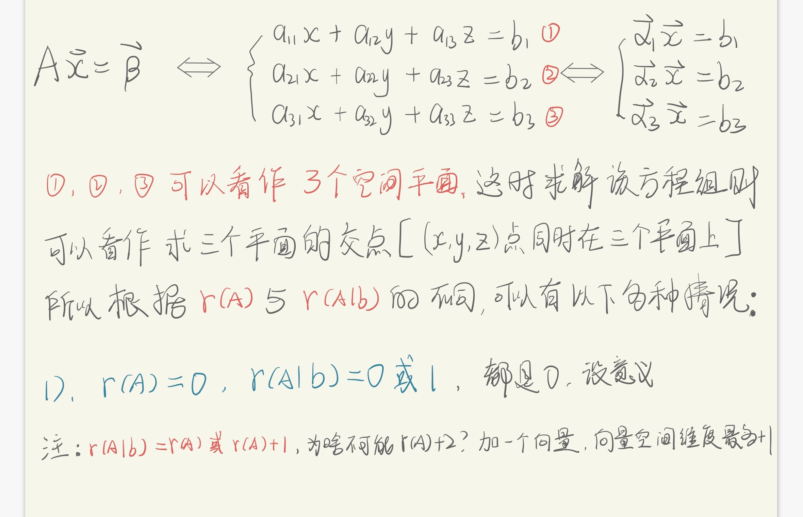
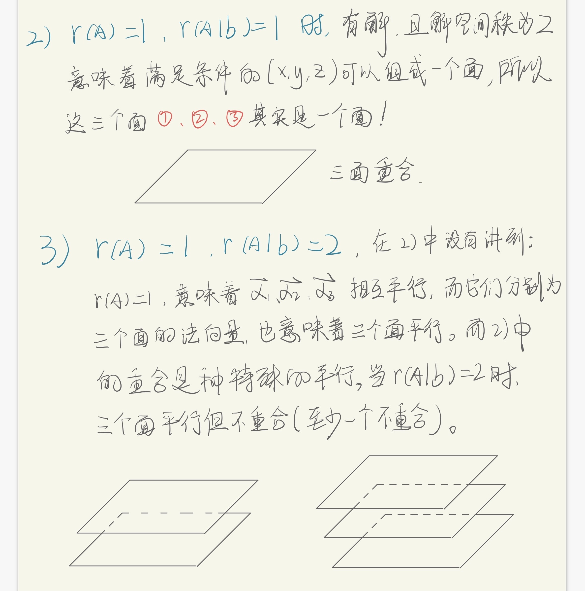
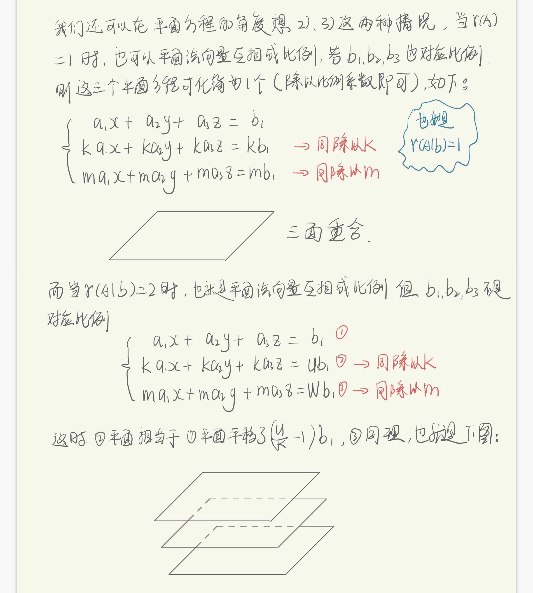
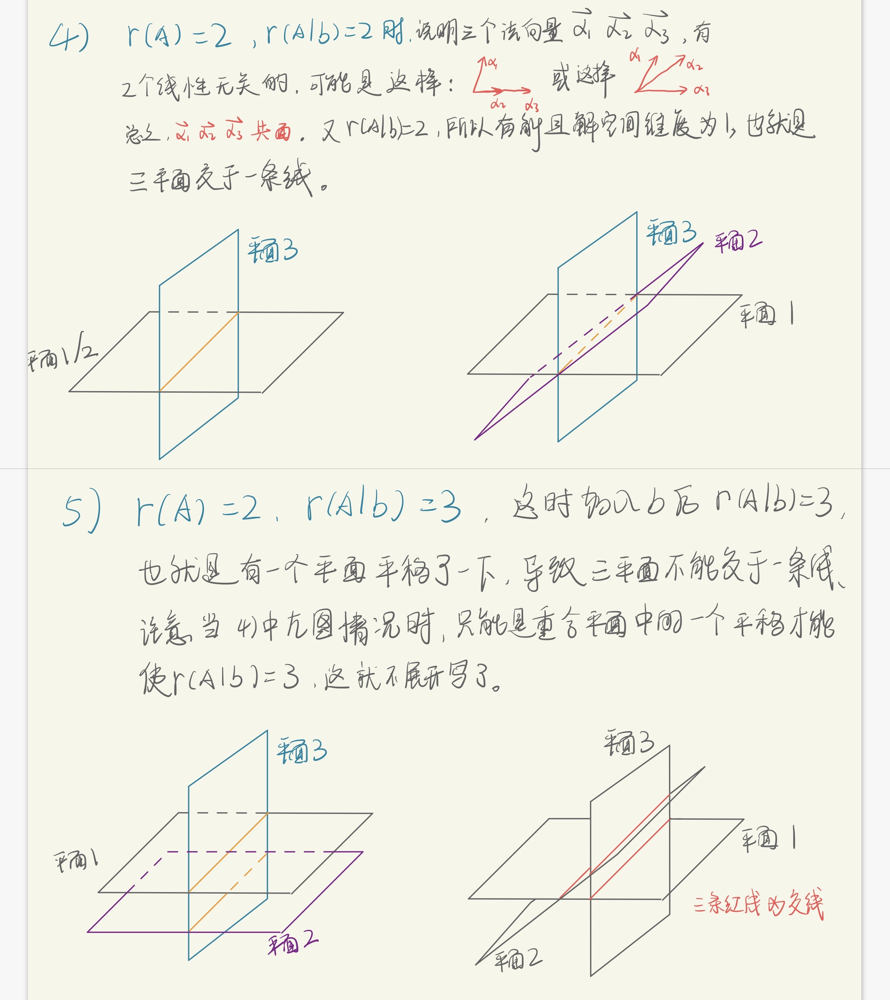

# 线性方程组与平面交点

[toc]

## 问题描述

我们假设有三个三元一次方程组成的线形方程组，则这三个方程也可以分别看作是三个平面的解析式---平面方程，则求解方程组就是找到三个平面的交点：

则我们再分为r(A)=1、2、3这三种情况讨论：

## r(A)=1

这时我们可以同样**以平面方程的角度重新思考这个问题**：

## r(A)=2

## r(A)=3

## 总结

线性代数就是这样一门很神奇的学科，它描述的这种线性关系，让满足线性的看似不相关的事情，有着完全一致的规律。

